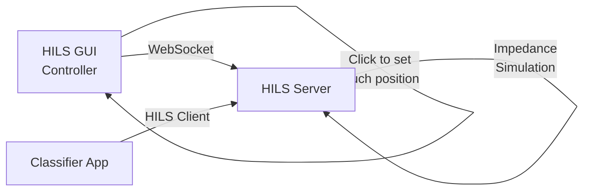
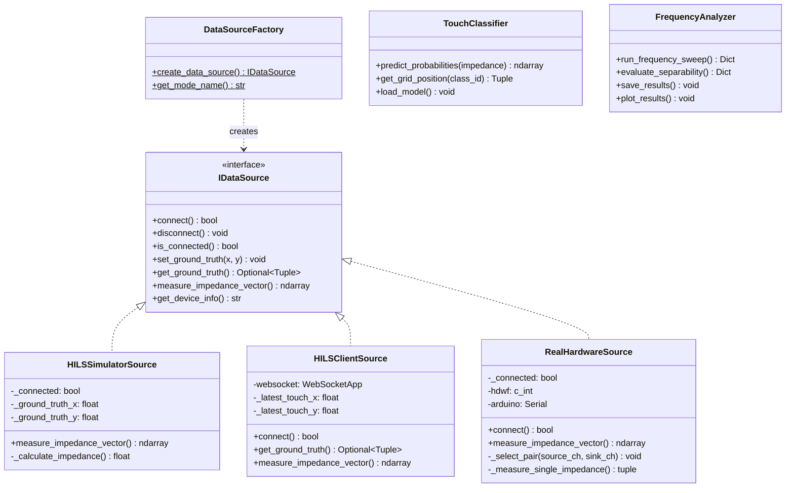

# Ion Gel Touch Position Estimation System

イオンゲルのタッチ位置をインピーダンス測定から推定するシステムです。HILS（Hardware-In-the-Loop Simulation）と実機を設定変更で切り替え可能です。

## 🚀 クイックスタート

### HILSモード（シミュレータ）で試す

```cmd
# 全システムを一括起動
start_full_hils_system.bat
```

これだけで、以下の3つのウィンドウが立ち上がります：
1. **HILS Server** - バックエンドサーバー
2. **HILS Controller** - タッチ位置操作GUI
3. **Classifier App** - 判定結果表示GUI

## 📋 目次

- [特徴](#特徴)
- [システム構成](#システム構成)
- [プロジェクト構造](#プロジェクト構造)
- [セットアップ](#セットアップ)
- [使い方](#使い方)
  - [データ収集・学習・推論](#データ収集学習推論)
  - [HILS フルシステム](#hilsフルシステム)
  - [周波数分析](#周波数分析)
- [アーキテクチャ](#アーキテクチャ)
- [トラブルシューティング](#トラブルシューティング)

## ✨ 特徴

- **デュアルMUX構成**: CD4051 x2 で任意の端子ペアを選択可能
- **HILS/実機切り替え**: `config.py` の1行でシームレスに切り替え
- **サーバー・クライアント分離**: WebSocketによる分散アーキテクチャ
- **Strategyパターン**: 抽象インターフェースで実装を分離
- **モダンGUI**: customtkinter による直感的な操作
- **機械学習**: MLPRegressorと分類器で位置推定
- **周波数最適化**: 自動周波数分析ツール搭載
- **リアルタイム検証**: 確率ヒートマップとメトリクス表示

## 🏗️ システム構成

### 実機モード

```
┌─────────────┐
│   PC        │
│  (Python)   │
└──────┬──────┘
       │ USB
       ├────────────┐
       │            │
┌──────▼──────┐ ┌──▼─────────┐
│  Arduino    │ │    AD3     │
│    Uno      │ │ (Impedance)│
└──────┬──────┘ └──┬─────┬───┘
       │           │     │
    GPIO(6本)   W1+1+  1-+GND
       │           │     │
    ┌──▼───────────▼─────▼──┐
    │  CD4051 x2 (Dual MUX) │
    └──────────┬─────────────┘
               │
        ┌──────▼──────┐
        │  Ion Gel    │
        │ (A, B, C, D)│
        └─────────────┘
```

### HILSモード（サーバー・クライアント）



## 📁 プロジェクト構造

```
gelNN/
├── config.py                    # 設定ファイル（HILS/実機切り替え）
├── interfaces.py                # 抽象インターフェース定義
│
├── simulator.py                 # HILSシミュレータ（ローカル版）
├── hils_server.py               # HILSサーバー（WebSocket）
├── hils_client.py               # HILSクライアント
├── hils_gui.py                  # HILS操作GUI
│
├── hardware.py                  # 実機ドライバ実装
├── factory.py                   # ファクトリパターン
│
├── app.py                       # データ収集・学習・推論GUI
├── app_classifier.py            # リアルタイム分類器GUI
├── model_classifier.py          # TouchClassifierクラス
├── train.py                     # モデル学習スクリプト
│
├── frequency_analyzer.py        # 周波数分析ツール ⭐NEW
│
├── dwfconstants.py              # AD3 SDK定数
│
├── start_full_hils_system.bat   # HILSフルシステム起動 ⭐
├── start_hils_classifier.bat    # 分類器単独起動
├── requirements.txt             # Python依存関係
│
├── arduino/
│   └── mux_controller/
│       └── mux_controller.ino   # デュアルMUX制御ファームウェア
│
├── data/                        # 学習データ保存先
└── models/                      # 学習済みモデル保存先
```

## 🔧 セットアップ

### 1. 依存関係のインストール

```cmd
pip install -r requirements.txt
```

または手動で：

```cmd
pip install customtkinter websockets numpy scikit-learn pyserial matplotlib
```

バッチファイルを使用する場合、初回起動時に自動的にインストールされます。

### 2. AD3 SDK（実機使用時のみ）

1. [WaveForms](https://digilent.com/shop/software/digilent-waveforms/) をダウンロード・インストール
2. SDK が自動的にインストールされます

### 3. Arduino（実機使用時のみ）

1. Arduino IDE で `arduino/mux_controller/mux_controller.ino` を開く
2. Arduino Uno に書き込み
3. `config.py` の `ARDUINO_PORT` を環境に合わせて設定

### 4. モード設定

`config.py` を編集:

```python
# HILSモード（シミュレータ）
USE_REAL_HARDWARE = False
USE_HILS_SERVER = True  # サーバーモード

# 実機モード
USE_REAL_HARDWARE = True
```

## 📖 使い方

### データ収集・学習・推論

**起動:**
```cmd
python app.py
```

**ワークフロー:**

1. **データ収集**
   - "Start Collection" をクリック
   - キャンバス上の任意の位置をクリック
   - その位置でインピーダンスデータが収集されます

2. **モデル学習**
   - 十分なデータを収集（推奨: 各位置10サンプル以上）
   - "Train Model" をクリック
   - 学習完了まで待機

3. **推論**
   - "Start Inference" をクリック
   - キャンバスをクリックすると、推定位置が表示されます

4. **周波数分析** ⭐NEW
   - サイドバーの "Analyze Frequencies" ボタンをクリック
   - 周波数分析ツールが別ウィンドウで起動
   - 最適周波数が自動的に決定され、設定ファイルに保存されます

---

### HILS フルシステム

**起動:**
```cmd
start_full_hils_system.bat
```

**3つのウィンドウ:**

1. **HILS Server** (`hils_server.py`)
   - WebSocketサーバー（ポート8765）
   - タッチ状態管理
   - インピーダンス計算

2. **HILS Controller** (`hils_gui.py`)
   - タッチ位置操作GUI
   - グリッドセルをクリックで正解位置を設定
   - 視覚的フィードバック

3. **Classifier App** (`app_classifier.py`)
   - リアルタイム分類器
   - 確率ヒートマップ表示
   - 正解位置との比較
   - 精度メトリクス表示（Accuracy, Error統計）

**使用方法:**
1. HILS Controllerでグリッドセルをクリック → タッチ位置を設定
2. Classifier Appで自動的に予測が実行される
3. 予測が正解の場合は緑の枠、不正解の場合は赤い枠が表示
4. 右下のメトリクスパネルで精度を確認

---

### 周波数分析 ⭐NEW

**目的:**
イオンゲルのインピーダンス特性の周波数依存性を分析し、タッチ位置判別に最適な測定周波数を特定します。

**起動方法1: コマンドライン**

```cmd
# HILSモードで実行
python frequency_analyzer.py --mode hils

# 実機モードで実行
python frequency_analyzer.py --mode real

# パラメータ指定
python frequency_analyzer.py --mode hils --min-freq 500 --max-freq 50000 --num-points 20
```

**起動方法2: GUIから**

`app.py` 起動後、サイドバーの "Analyze Frequencies" ボタンをクリック

**オプション:**
- `--min-freq`: 最小周波数 [Hz] (デフォルト: 100)
- `--max-freq`: 最大周波数 [Hz] (デフォルト: 100000)
- `--num-points`: 測定点数 (デフォルト: 15)
- `--samples`: 1位置あたりのサンプル数 (デフォルト: 5)

**出力:**
- `frequency_config.json` - 分析結果（最適周波数、推奨周波数リスト、Fisher比など）
- `frequency_analysis_results.png` - 可視化グラフ

**分析アルゴリズム:**
- **Fisher比**: クラス間分散 / クラス内分散
- **Silhouette Score**: クラスタリング品質
- **PCA分離度**: 主成分分析による評価

---

### その他のスクリプト

**モデル学習（バッチ処理）:**
```cmd
python train.py
```

**自動テスト（HILS）:**
```cmd
python test_auto.py
```

## 🏛️ アーキテクチャ

### クラス図



### 物理モデル（HILS）

距離減衰モデル:

```
インピーダンス = BASE_IMPEDANCE + DISTANCE_FACTOR × distance
```

- `distance`: タッチ位置からSource-Sink経路までの距離
- ノイズ: 5%のガウシアンノイズを付加

## 🔍 ハードウェア仕様

### 測定ペア

| Pair ID | Source | Sink | 説明 |
|---------|--------|------|------|
| 0 | A (Ch0) | B (Ch1) | A→B |
| 1 | A (Ch0) | D (Ch3) | A→D |
| 2 | B (Ch1) | C (Ch2) | B→C |
| 3 | B (Ch1) | D (Ch3) | B→D |
| 4 | C (Ch2) | D (Ch3) | C→D |
| 5 | A (Ch0) | C (Ch2) | A→C |

### Arduino ピンアサイン

| Pin | 機能 | 接続先 |
|-----|------|--------|
| D2 | Mux1_S0 | CD4051(Mux1) S0 |
| D3 | Mux1_S1 | CD4051(Mux1) S1 |
| D4 | Mux1_S2 | CD4051(Mux1) S2 |
| D5 | Mux2_S0 | CD4051(Mux2) S0 |
| D6 | Mux2_S1 | CD4051(Mux2) S1 |
| D7 | Mux2_S2 | CD4051(Mux2) S2 |

## 🐛 トラブルシューティング

### バッチファイル起動時のエラー

**文字化けする:**
- バッチファイルはUTF-8対応済み
- メッセージは英語で表示されます

**モジュールが見つからない:**
```cmd
pip install -r requirements.txt
```

**ポート8765が使用中:**
- 別のプログラムがポートを使用している可能性
- 該当アプリを終了するか、`config.py` の `HILS_SERVER_PORT` を変更

### HILS モードで起動しない

- `config.py` で `USE_REAL_HARDWARE = False` になっているか確認
- `USE_HILS_SERVER = True` になっているか確認

### 実機モードで接続エラー

1. AD3が接続されているか確認
2. Arduinoが正しいポートに接続されているか確認
3. `config.py` の `ARDUINO_PORT` を確認
4. WaveForms SDK がインストールされているか確認

### 推論精度が低い

1. より多くのデータを収集（推奨: 100サンプル以上）
2. グリッド上に均等にデータを配置
3. 周波数分析ツールで最適周波数を決定
4. `config.py` の `HIDDEN_LAYER_SIZES` を調整

### 周波数分析が遅い

- HILSモード: 数分で完了
- 実機モード: 各周波数で測定時間がかかる（全体で10～30分程度）
- `--num-points` を減らして測定点を削減

## 📚 設定ファイル

### config.py

主要な設定項目:

```python
# モード切り替え
USE_REAL_HARDWARE = False  # True: 実機, False: HILS
USE_HILS_SERVER = True     # True: サーバー, False: ローカル

# 測定パラメータ
MEASUREMENT_FREQUENCY = 1000.0  # [Hz]
MEASUREMENT_AMPLITUDE = 0.1     # [V]

# Arduino設定
ARDUINO_PORT = "COM3"
ARDUINO_BAUDRATE = 9600

# HILSサーバー設定
HILS_SERVER_HOST = "localhost"
HILS_SERVER_PORT = 8765

# 機械学習設定
HIDDEN_LAYER_SIZES = (100, 50)
MAX_ITERATIONS = 1000
```

### frequency_config.json（自動生成）

周波数分析の結果:

```json
{
  "optimal_frequency": 1000.0,
  "recommended_frequencies": [1000, 5000, 2000],
  "analysis_results": {
    "frequencies_tested": [...],
    "fisher_ratios": [...],
    "silhouette_scores": [...]
  }
}
```

## 🎯 推奨ワークフロー

1. **初期セットアップ:**
   - 依存関係をインストール
   - `config.py` を編集してHILSモードに設定

2. **HILSでテスト:**
   - `start_full_hils_system.bat` で起動
   - システムの動作を確認
   - HILS Controllerでグリッドをクリックして動作確認

3. **周波数分析（実機のみ）:**
   - 実機モードに切り替え：`USE_REAL_HARDWARE = True`
   - `python frequency_analyzer.py --mode real` を実行
   - 最適周波数を特定

4. **データ収集:**
   - `python app.py` でデータ収集GUI起動
   - グリッド上に均等にサンプルを配置

5. **学習:**
   - "Train Model" で学習
   - または `python train.py` でバッチ学習

6. **検証:**
   - `app_classifier.py` でリアルタイム分類器を起動
   - 精度メトリクスを確認

## 📄 ライセンス

MIT License

## 👥 作成者

Ion Gel Touch Estimation Project Team
