# Single Terminal Standalone

単一端子押圧検出のスタンドアロンパッケージです。
このフォルダだけで動作します。

## 必要なもの

- Python 3.10+
- Analog Discovery 3 + WaveForms SDK（実機モード時）

## セットアップ

```bash
cd single_terminal_standalone
pip install -r requirements.txt
```

## 実行

```bash
python run.py
```

または `run.bat` をダブルクリック。

## モード切替

[src/utils/config.py](src/utils/config.py) の `USE_REAL_HARDWARE` を変更:

- `True` : AD3 実機モード（デフォルト）
- `False`: HILS シミュレータモード（ハードウェア不要）

## フォルダ構成

```
single_terminal_standalone/
├── run.py                  # エントリポイント
├── run.bat                 # Windows 用バッチファイル
├── requirements.txt        # 必要パッケージ
├── README.md
├── models/                 # 学習済みモデル保存先
├── data/                   # データ保存先
├── logs/                   # ログ保存先
└── src/
    ├── core/
    │   ├── interfaces.py       # IDataSource 抽象クラス
    │   └── models/
    │       └── press_classifier.py  # NN 二値分類器
    ├── gui/
    │   └── app_single_terminal.py   # メイン GUI
    ├── hardware/
    │   ├── ad3_only.py         # AD3 単体ドライバ
    │   └── dwfconstants.py     # DWF SDK 定数
    ├── hils/
    │   ├── simulator.py        # HILS シミュレータ
    │   └── client.py           # HILS クライアント
    └── utils/
        └── config.py           # 設定
```

## 押圧判定アルゴリズム

### 概要

イオンゲルの単一端子に対して AD3 のインピーダンスアナライザで測定を行い、  
「押されている（PRESSED）」か「離されている（RELEASED）」かをニューラルネットワーク（MLP）で二値分類します。

### アルゴリズムフローチャート

```mermaid
flowchart TD
    subgraph 学習フェーズ
        T1["① RELEASED 状態で<br/>90サンプル収集"]
        T2["② PRESSED 状態で<br/>90サンプル収集"]
        T3{"スイープモード?"}
        T4["2-20kHz スイープ<br/>→ 10D 特徴量抽出"]
        T5["固定周波数 (1kHz)<br/>→ 2D 特徴量"]
        T6["StandardScaler で<br/>特徴量を正規化<br/>(mean=0, std=1)"]
        T7["MLPClassifier 学習<br/>hidden=(32,16)<br/>train/test = 80/20"]
        T8["モデル・スケーラー<br/>・学習データを保存"]

        T1 --> T3
        T2 --> T3
        T3 -->|Yes| T4
        T3 -->|No| T5
        T4 --> T6
        T5 --> T6
        T6 --> T7
        T7 --> T8
    end

    subgraph 判定フェーズ
        D1["Start 押下"]
        D2["キャリブレーション<br/>(RELEASED 状態で<br/>10サンプル収集)"]
        D3["ドリフト量 δ 推定<br/>δ = calib_mean<br/>− train_released_mean"]
        D4["スケーラー補正<br/>mean' = mean + δ"]
        D5["リアルタイム測定<br/>(スイープ or 固定)"]
        D6["特徴量抽出<br/>+ 補正済みスケーラー<br/>で正規化"]
        D7["MLP 推論<br/>→ press確率 p"]
        D8{"p ≥ 0.5 ?"}
        D9["PRESSED"]
        D10["RELEASED"]

        D1 --> D2
        D2 --> D3
        D3 --> D4
        D4 --> D5
        D5 --> D6
        D6 --> D7
        D7 --> D8
        D8 -->|Yes| D9
        D8 -->|No| D10
        D9 --> D5
        D10 --> D5
    end

    style T1 fill:#336633,color:#fff
    style T2 fill:#663333,color:#fff
    style D9 fill:#ff3333,color:#fff
    style D10 fill:#33ff33,color:#000
```



### 特徴量の詳細

#### 固定周波数モード (2D)

| # | 特徴量 | 説明 |
|---|--------|------|
| 1 | `log10(mag + 1)` | インピーダンス振幅 \|Z\| の対数変換 |
| 2 | `phase` | 位相 [rad] |

#### スイープモード (10D)

2–20 kHz の周波数スイープ結果から抽出するスペクトル特徴量:

| # | 特徴量 | 説明 |
|---|--------|------|
| 1 | `log10(peak_freq)` | リアクタンス \|X\| ピーク周波数の対数 |
| 2 | `log10(peak_mag + 1)` | ピーク時の \|Z\| の対数 |
| 3 | `peak_phase` | ピーク時の位相 [rad] |
| 4 | `log10(z_mean_low + 1)` | 低域帯 \|Z\| 平均の対数 |
| 5 | `log10(z_mean_mid + 1)` | 中域帯 \|Z\| 平均の対数 |
| 6 | `log10(z_mean_high + 1)` | 高域帯 \|Z\| 平均の対数 |
| 7 | `x_mean_low` | 低域帯リアクタンス X 平均 [Ω] |
| 8 | `x_mean_mid` | 中域帯リアクタンス X 平均 [Ω] |
| 9 | `x_mean_high` | 高域帯リアクタンス X 平均 [Ω] |
| 10 | `x_slope` | リアクタンスの対数周波数に対する傾き |

スイープ範囲は低域 / 中域 / 高域の3バンドに均等分割されます。

### ベースラインドリフト補正（キャリブレーション）

インピーダンスセンサーの絶対値は温度・湿度・ゲルの乾燥等で経時的にドリフトします。
StandardScaler の正規化は学習時のデータ分布に依存するため、
ドリフトにより特徴量がわずかでも変化すると **全ての測定が一方のクラスに偏る** 問題が発生します。

**例**: z 系特徴量の訓練時 std ≈ 0.003 に対し、インピーダンスが 2% 変化（log10 で ≈ 0.01 ずれ）すると、
正規化後の値が 3σ 以上シフトし、MLP が 100% プレスと判定してしまいます。

#### 解決策: 自動キャリブレーション

判定開始時に「離した状態」で 10 サンプル取得し、現在のベースラインを計測します。
訓練時の RELEASED 状態平均との差分（ドリフト量 δ）を算出し、
スケーラーの mean を `mean' = mean + δ` に補正します。

```
元のスケーラー:  scaled = (x - mean) / std
ドリフト後:      x' = x + δ
補正スケーラー:  scaled = (x' - (mean + δ)) / std = (x - mean) / std  ← 元と同じ
```

これにより、モデルの重みを変更せずに、
ドリフトした環境でも訓練時と同じ特徴空間で判定できます。

### ニューラルネットワーク構成

```
入力 → [2D or 10D] → StandardScaler → MLP(32, 16) → Sigmoid → 押圧確率
```

- **アーキテクチャ**: `MLPClassifier(hidden_layer_sizes=(32, 16))`
- **活性化関数**: ReLU（隠れ層）+ Softmax（出力層）
- **最適化**: Adam, 初期学習率 0.01, adaptive
- **最大イテレーション**: 2000
- **訓練/テスト分割**: 80% / 20% (stratified)

